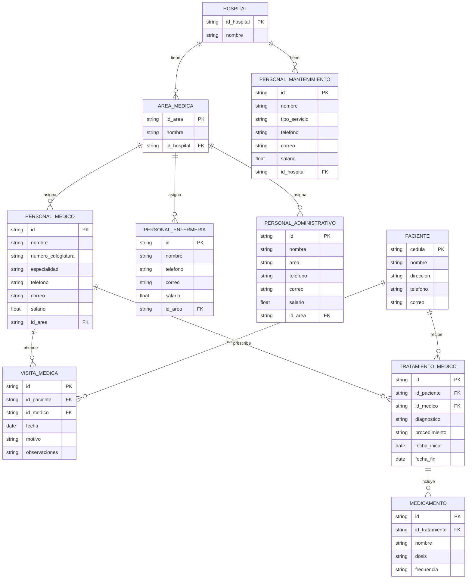

<h3 align="center";>

**PROYECTO SISTEMA HOSPITALARIO**

</h3>

 
 
 

<h3 align="center";>

**Alejandra Pinzón Alvares**

</h3>

<h3 align="center";>

**Juan David Vargas Soto**

</h3>

 
 
 
 

<h3 align="center";>

**S1**

</h3>

<h3 align="center";>

**Pedro Felipe Gómez Bonilla**

</h3>

 
 
 
 

<h3 align="center";>

**CAMPUSLANDS**

</h3>

<h3 align="center";>

**RUTA NODE**

</h3>

<h3 align="center";>

**BUCARAMANGA, SANTANDER**

</h3>

<h3 align="center";>

**2025**

</h3>

---

## Tabla de Contenido

- [Introducción](#introducción)  
- [Caso de Estudio](#caso-de-estudio)   
- [Instalación General](#instalación-general)  
- [Planificación](#planificación)  
- [Ejecución](#ejecución)   

---

## Introducción

Este documento servirá como una guía detallada del proceso completo de diseño, estructuración e implementación de una base de datos para un sistema de gestión hospitalaria utilizando MongoDB. El objetivo principal es gestionar eficazmente los datos e información generados por los hospitales y administrado por los usuarios específicos.

Inicialmente, se analizará el caso de estudio junto con sus requerimientos específicos. A partir de esta investigación, se procederá a desarrollar un modelo conceptual detallado donde se identificarán las entidades principales, sus atributos y las relaciones entre ellas. Este paso determina las bases para comprender la estructura esencial de la gestión de los hospitales.

A continuación, se realizará la conversión del modelo conceptual al modelo lógico. Este último ofrece una representación más precisa de cómo se organizará la información, facilitando una comprensión clara de la base de datos en desarrollo. Se aplicará el proceso de Normalización hasta la tercera forma normal (3FN) para optimizar la organización de los datos, reduciendo redundancias y eliminando dependencias transitivas.

Posteriormente, se llevará a cabo la conversión del modelo lógico al modelo físico, el cual define la implementación real de entidades, atributos y relaciones, incorporando detalles técnicos como los tipos de datos adecuados para cada elemento.

Para mejorar la comprensión del sistema, se incluirá un diagrama UML que visualice de manera gráfica y concisa la estructura de la base de datos y sus relaciones.

Finalmente, se detallarán algunos procedimientos, funciones y consultas que complementarán la funcionalidad del sistema de información desarrollado, asegurando así su eficiencia y utilidad para el establecimiento hospitalario.

Con estos pasos y elementos, se garantiza una guía completa y efectiva para el diseño y desarrollo de la base de datos necesaria para la gestión eficiente en los hospitales.

---

## Caso de Estudio

El caso de estudio consiste en diseñar y desarrollar un sistema de base de datos usando MongoDB el cual permitirá gestionar y manejar de manera eficiente todas las operaciones administrativas de un sistema hospitalario, teniendo en cuenta la capacidad de varios hospitales junto a historiales clínicos, datos de médicos, enfermeros y pacientes con su respectiva área (como cardiología o neurología) de acuerdo a cada hospital. Adicionalmente, se tendrá en cuenta inventarios de medicamentos, y una alta demanda de gestión de pacientes y visitas médicas.

Cada hospital es supervisado por un Gerente Especialista al que están encargados diferentes profesionales de la salud, como médicos especialistas, enfermeros, personal de mantenimiento y personal administrativo. La información importante relacionada con los pacientes, como su historial clínico, visitas médicas, tratamientos y medicamentos administrados, será registrada y accesible de forma segura y rápida.

## Objetivo del Sistema

El sistema está diseñado para:

- Gestionar información estructurada de hospitales, personal, pacientes, tratamientos, visitas y medicamentos.
- Ejecutar consultas complejas que permitan monitorear el estado de los hospitales, inventarios de medicamentos y estadísticas clínicas.
- Simular funciones automatizadas que apoyen la generación de reportes.
- Controlar el acceso a la información según roles definidos para cada tipo de usuario.

## Componentes Clave del Sistema

**Modelado de Base de Datos:**  
Incluye estructuras para hospitales, personal, pacientes, historiales clínicos, visitas médicas, medicamentos y tratamientos.

**Consultas MongoDB (100):**  
Consultas para obtener reportes operativos y clínicos, 20 de ellas con agregaciones avanzadas.

**Funciones JavaScript (20):**  
Simulaciones de procedimientos como estadísticas de visitas médicas o cálculos de inventario.

**Control de Acceso:**  
Definición de cinco tipos de usuario con permisos diferenciados.

**Usuarios asignados:**

- `001`: Gerente Especialista – Gestión general del hospital.  
- `002`: Médico General – Atiende pacientes y realiza diagnósticos.  
- `003`: Enfermero/a – Asiste a médicos y cuida a los pacientes.  
- `004`: Personal Administrativo – Gestión de recursos y logística.  
- `005`: Personal de Mantenimiento – Mantenimiento y limpieza de las instalaciones.  

**Control de acceso y roles de usuario:**

- **Gerente Especialista:** Acceso total.  
- **Médico General:** Acceso a pacientes y diagnósticos.  
- **Enfermero/a:** Acceso limitado a pacientes asignados.  
- **Personal Administrativo:** Gestión de recursos y logística.  
- **Personal de Mantenimiento:** Acceso a tareas de infraestructura.

---

## Instalación General

Los archivos relacionados con la BBDD del Sistema Hospitalario, se encuentran en la plataforma [GitHub](https://github.com/httml-juandvs/ProyectoMongoDB_VartgasJuan_PinzonAlejandra.git). Estos archivos se encuentran en formato `.json` y se dividen en 5 partes:

- **ddl.json:** Script para crear la base de datos y definir las colecciones correspondientes.  
- **dml.json:** Ejemplos de datos para gestionar los hospitales, facilitando la inserción inicial de información.  
- **dql_select.json:** Consultas relacionadas con departamentos, hospitales e historiales clínicos.  
- **Readme.md:** Procedimientos y funciones para añadir, actualizar y mostrar datos dentro del sistema.  
- **Diagrama.jpg:** Contiene los modelos Conceptual, Relacional y Entidad-Relación.

---

## Planificación

**Ejecución**

Una vez analizados los requerimientos establecidos para el desarrollo de un sistema hospitalario eficiente, se dio inicio al proceso de diseño del modelo de base de datos en MongoDB. Este análisis incluyó tanto los lineamientos académicos como las prácticas recomendadas por entidades del sector salud, tales como el Ministerio de Salud de Colombia, para garantizar la integridad, trazabilidad y escalabilidad de la información clínica y administrativa.

**Construcción del Modelo Conceptual**

Se diseñó el modelo conceptual identificando cada una de las entidades, sus atributos y las relaciones entre ellas. Este modelo conceptual proporciona una visión clara y estructurada de cómo se organizarán y conectarán los diferentes elementos de la base de datos.

Para entender el diseño del modelo conceptual, se debe tener en cuenta los elementos básicos de un modelo original.

**Descripción de Entidades y Atributos**

*1. Hospital*
- `id_hospital`: ID único del hospital.
- `nombre`: Nombre del hospital.

*2. Área Médica*
- `id_area`: ID único del área.
- `id_hospital`: Hospital al que pertenece.
- `nombre`: Nombre del área médica (cardiología, neurología, etc.).

*3. Personal Médico*
- `id`: ID único del personal médico.
- `numero_colegiatura`: Número de colegiatura médica.
- `nombre`: Nombre completo.
- `especialidad`: Especialidad médica.
- `teléfono`: Número de celular.
- `correo`: Dirección de correo electrónico.
- `salario`: Salario.

*4. Personal de Enfermería*
- `id`: ID único.
- `id_personal`: ID del personal.
- `nombre`: Nombre completo.
- `teléfono`: Número de celular.
- `correo`: Dirección de correo electrónico.
- `salario`: Salario.

*5. Personal Administrativo*
- `id`: ID único.
- `id_personal`: ID del personal.
- `area`: Área administrativa en la que labora.
- `nombre`: Nombre completo.
- `teléfono`: Número de celular.
- `correo`: Dirección de correo electrónico.
- `salario`: Salario.

*6. Personal de Mantenimiento*
- `id`: ID único.
- `id_personal`: ID del personal.
- `tipo_servicio`: Tipo de servicio prestado (limpieza, eléctrico, etc.).
- `nombre`: Nombre completo.
- `teléfono`: Número de celular.
- `correo`: Dirección de correo electrónico.
- `salario`: Salario.

*7. Paciente*
- `cedula`: Cédula del paciente.
- `nombre`: Nombre completo.
- `direccion`: Dirección.
- `teléfono`: Número de celular.
- `correo`: Dirección de correo electrónico.

*8. Tratamiento Médico*
- `id`: ID único de ltratamiento.
- `id_paciente`: ID del paciente.
- `id_medico`: ID del médico tratante.
- `diagnostico`: Descripción del diagnóstico.
- `procedimiento`: Procedimientos realizados.
- `fecha_inicio`: Fecha de inicio.
- `fecha_fin`: Fecha de finalización (opcional).

*9. Medicamento*
- `id`: ID único del medicamento recetado.
- `id_tratamiento`: ID del tratamiento.
- `nombre`: Nombre del medicamento.
- `dosis`: Dosis indicada.
- `frecuencia`: Frecuencia de administración.

*10. Visita Médica*
- `id`: ID único de la visita.
- `id_paciente`: ID del paciente.
- `id_medico`: ID del médico.
- `fecha`: Fecha de la consulta.
- `motivo`: Motivo de la visita.
- `observaciones`: Observaciones médicas.

### Relaciones y Cardinalidades del Modelo Conceptual

Se definieron las siguientes relaciones entre entidades para representar el sistema hospitalario:

1. Hospital – Área Médica  
❖ Relación: "Tiene", un hospital puede tener muchas áreas médicas.  
❖ Cardinalidad: 1-N (uno a muchos).  

2. Hospital – Personal de Mantenimiento  
❖ Relación: "Cuenta", un hospital puede tener muchos trabajadores de mantenimiento.  
❖ Cardinalidad: 1-N (uno a muchos).  

3. Área Médica – Personal Médico  
❖ Relación: "Asigna", una área médica puede tener muchos médicos.  
❖ Cardinalidad: 1-N (uno a muchos).  

4. Área Médica – Personal de Enfermería  
❖ Relación: "Asigna", una área médica puede tener muchos enfermeros.  
❖ Cardinalidad: 1-N (uno a muchos).  

5. Área Médica – Personal Administrativo  
❖ Relación: "Asigna", una área médica puede tener muchos administrativos.  
❖ Cardinalidad: 1-N (uno a muchos).  

6. Personal Médico – Visita Médica  
❖ Relación: "Atiende", un médico puede atender muchas visitas médicas.  
❖ Cardinalidad: 1-N (uno a muchos).  

7. Paciente – Visita Médica  
❖ Relación: "Realiza", un paciente puede tener varias visitas médicas.  
❖ Cardinalidad: 1-N (uno a muchos).  

8. Personal Médico – Tratamiento Médico  
❖ Relación: "Prescribe", un médico puede indicar muchos tratamientos.  
❖ Cardinalidad: 1-N (uno a muchos).  

9. Paciente – Tratamiento Médico  
❖ Relación: "Recibe", un paciente puede recibir muchos tratamientos.  
❖ Cardinalidad: 1-N (uno a muchos).  

10. Tratamiento Médico – Medicamento  
❖ Relación: "Incluye", un tratamiento puede incluir muchos medicamentos.  
❖ Cardinalidad: 1-N (uno a muchos).  

