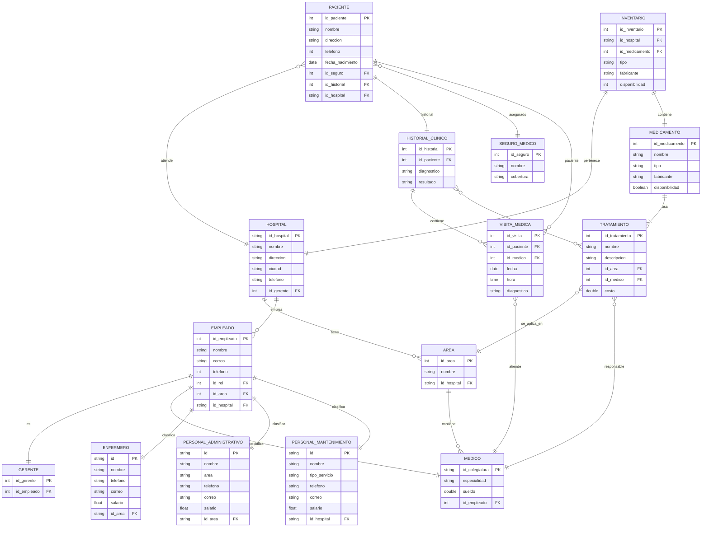

<h3 align="center";>

**PROYECTO SISTEMA HOSPITALARIO**

</h3>

<br>
<br>
<br>

<h3 align="center";>

**Alejandra Pinzón Alvares**

</h3>

<h3 align="center";>

**Juan David Vargas Soto**

</h3>

<br>
<br>
<br>
<br>

<h3 align="center";>

**S1**

</h3>

<h3 align="center";>

**Pedro Felipe Gómez Bonilla**

</h3>

<br>
<br>
<br>
<br>

<h3 align="center";>

**CAMPUSLANDS**

</h3>

<h3 align="center";>

**RUTA NODE JS**

</h3>

<h3 align="center";>

**BUCARAMANGA, SANTANDER**

</h3>

<h3 align="center";>

**2025**

</h3>


---

## Tabla de Contenidos

- [Introducción](#introducción)  
- [Caso de Estudio](#caso-de-estudio)   
- [Instalación General](#instalación-general)  
- [Planificación](#planificación)  
- [Modelo Conceptual](#Construcción-del-Modelo-Conceptual)
- [Construcción del Modelo Lógico](#construcción-del-modelo-lógico)
- [Normalización del Modelo Lógico](#normalización-del-modelo-lógico)
- [Control de Acceso y Roles de Usuario](#Control-de-acceso-y-roles-de-datos)

---

## Introducción

Este documento servirá como una guía detallada del proceso completo de diseño, estructuración e implementación de una base de datos para un sistema de gestión hospitalaria utilizando MongoDB. El objetivo principal es gestionar eficazmente los datos e información generados por los hospitales y administrado por los usuarios específicos.

Inicialmente, se analizará el caso de estudio junto con sus requerimientos específicos. A partir de esta investigación, se procederá a desarrollar un modelo conceptual detallado donde se identificarán las entidades principales, sus atributos y las relaciones entre ellas. Este paso determina las bases para comprender la estructura esencial de la gestión de los hospitales.

A continuación, se realizará la conversión del modelo conceptual al modelo lógico. Este último ofrece una representación más precisa de cómo se organizará la información, facilitando una comprensión clara de la base de datos en desarrollo. Se aplicará el proceso de Normalización hasta la tercera forma normal (3FN) para optimizar la organización de los datos, reduciendo redundancias y eliminando dependencias transitivas.

Posteriormente, se llevará a cabo la conversión del modelo lógico al modelo físico, el cual define la implementación real de entidades, atributos y relaciones, incorporando detalles técnicos como los tipos de datos adecuados para cada elemento.

Para mejorar la comprensión del sistema, se incluirá un diagrama UML que visualice de manera gráfica y concisa la estructura de la base de datos y sus relaciones.

Finalmente, se detallarán algunos procedimientos, funciones y consultas que complementarán la funcionalidad del sistema de información desarrollado, asegurando así su eficiencia y utilidad para el establecimiento hospitalario.

Con estos pasos y elementos, se garantiza una guía completa y efectiva para el diseño y desarrollo de la base de datos necesaria para la gestión eficiente en los hospitales.

---

## Caso de Estudio

El caso de estudio consiste en diseñar y desarrollar un sistema de base de datos usando MongoDB el cual permitirá gestionar y manejar de manera eficiente todas las operaciones administrativas de un sistema hospitalario, teniendo en cuenta la capacidad de varios hospitales junto a historiales clínicos, datos de médicos, enfermeros y pacientes con su respectiva área (como cardiología o neurología) de acuerdo a cada hospital. Adicionalmente, se tendrá en cuenta inventarios de medicamentos, y una alta demanda de gestión de pacientes y visitas médicas.

Cada hospital es supervisado por un Gerente Especialista al que están encargados diferentes profesionales de la salud, como médicos especialistas, enfermeros, personal de mantenimiento y personal administrativo. La información importante relacionada con los pacientes, como su historial clínico, visitas médicas, tratamientos y medicamentos administrados, será registrada y accesible de forma segura y rápida.

## Objetivo del Sistema

El sistema está diseñado para:

- Gestionar información estructurada de hospitales, personal, pacientes, tratamientos, visitas y medicamentos.
- Ejecutar consultas complejas que permitan monitorear el estado de los hospitales, inventarios de medicamentos y estadísticas clínicas.
- Simular funciones automatizadas que apoyen la generación de reportes.
- Controlar el acceso a la información según roles definidos para cada tipo de usuario.


## Componentes Clave del Sistema

**Modelado de Base de Datos:**  
Incluye estructuras para hospitales, personal, pacientes, historiales clínicos, visitas médicas, medicamentos y tratamientos.

**Consultas MongoDB (100):**  
Consultas para obtener reportes operativos y clínicos, 20 de ellas con agregaciones avanzadas.

**Funciones JavaScript (20):**  
Simulaciones de procedimientos como estadísticas de visitas médicas o cálculos de inventario.

**Control de Acceso:**  
Definición de cinco tipos de usuario con permisos diferenciados.

**Usuarios asignados:**

- `001`: Gerente Especialista – Gestión general del hospital.  
- `002`: Médico General – Atiende pacientes y realiza diagnósticos.  
- `003`: Enfermero/a – Asiste a médicos y cuida a los pacientes.  
- `004`: Personal Administrativo – Gestión de recursos y logística.  
- `005`: Personal de Mantenimiento – Mantenimiento y limpieza de las instalaciones.  

**Control de acceso y roles de usuario:**

- **Gerente Especialista:** Acceso total.  
- **Médico General:** Acceso a pacientes y diagnósticos.  
- **Enfermero/a:** Acceso limitado a pacientes asignados.  
- **Personal Administrativo:** Gestión de recursos y logística.  
- **Personal de Mantenimiento:** Acceso a tareas de infraestructura.

---

## Instalación General

Los archivos relacionados con la BBDD del Sistema Hospitalario, se encuentran en la plataforma [GitHub](https://github.com/httml-juandvs/ProyectoMongoDB_VartgasJuan_PinzonAlejandra.git). Estos archivos se encuentran en formato `.json` y se dividen en 5 partes:

- **ddl.json:** Script para crear la base de datos y definir las colecciones correspondientes.  
- **dml.json:** Ejemplos de datos para gestionar los hospitales, facilitando la inserción inicial de información.  
- **dql_select.json:** Consultas relacionadas con departamentos, hospitales e historiales clínicos.  
- **Readme.md:** Procedimientos y funciones para añadir, actualizar y mostrar datos dentro del sistema.  
- **Diagrama.jpg:** Contiene los modelos Conceptual, Relacional y Entidad-Relación.

---

## Planificación


**Ejecución**

Una vez analizados los requerimientos establecidos para el desarrollo de un sistema hospitalario eficiente, se dio inicio al proceso de diseño del modelo de base de datos en MongoDB. Este análisis incluyó tanto los lineamientos académicos como las prácticas recomendadas por entidades del sector salud, tales como el Ministerio de Salud de Colombia, para garantizar la integridad, trazabilidad y escalabilidad de la información clínica y administrativa.

##**Construcción del Modelo Conceptual**

Se diseñó el modelo conceptual identificando cada una de las entidades, sus atributos y las relaciones entre ellas. Este modelo conceptual proporciona una visión clara y estructurada de cómo se organizarán y conectarán los diferentes elementos de la base de datos.

Para entender el diseño del modelo conceptual, se debe tener en cuenta los elementos básicos de un modelo original.

**Descripción de Entidades y Atributos**

*1. Hospital*
- `id_hospital`: ID único del hospital.
- `nombre`: Nombre del hospital.
- `direccion`: Dirección del hospital.
- `ciudad`: Ciudad donde se ubica el hospital.
- `telefono`: Número de teléfono del hospital.
- `id_gerente`: ID del gerente responsable del hospital.

*2. Gerente*
- `id_gerente`: ID único del gerente.
- `id_empleado`: ID del empleado que desempeña el rol de gerente.

*3. Empleado*
- `id_empleado`: ID único del empleado.
- `nombre`: Nombre completo del empleado.
- `correo`: Correo electrónico.
- `telefono`: Número de teléfono.
- `id_rol`: ID del rol desempeñado.
- `id_area`: ID del área de trabajo.
- `id_hospital`: ID del hospital donde labora.

*4. Médico*
- `id_colegiatura`: Número único de colegiatura.
- `nombre`: Nombre completo del médico.
- `especialidad`: Especialidad médica.
- `telefono`: Número de contacto.
- `correo`: Correo electrónico.
- `sueldo`: Sueldo asignado.
- `id_area`: ID del área médica donde labora.

*5. Área Médica*
- `id_area`: ID único del área.
- `id_hospital`: ID del hospital al que pertenece.
- `nombre`: Nombre del área médica (Cardiología, Pediatría, etc.).

*6. Paciente*
- `id_paciente`: ID único del paciente.
- `nombre`: Nombre completo.
- `direccion`: Dirección de residencia.
- `telefono`: Número de contacto.
- `fecha_nacimiento`: Fecha de nacimiento.
- `id_seguro`: ID del seguro médico.
- `id_historial`: ID del historial clínico.
- `id_hospital`: ID del hospital asignado.

*7. Historial Clínico*
- `id_historial`: ID único del historial clínico.
- `id_paciente`: ID del paciente asociado.
- `id_visita`: ID de la visita médica.
- `id_tratamiento`: ID del tratamiento aplicado.
- `diagnostico`: Diagnóstico realizado.
- `resultado`: Resultado del tratamiento.

*8. Visita Médica*
- `id_visita`: ID único de la visita.
- `id_paciente`: ID del paciente.
- `id_medico`: ID del médico que atendió.
- `fecha`: Fecha de la visita.
- `hora`: Hora de la visita.
- `diagnostico`: Diagnóstico médico emitido.

*9. Tratamiento*
- `id_tratamiento`: ID único del tratamiento.
- `nombre`: Nombre del tratamiento.
- `descripcion`: Descripción detallada.
- `id_area`: ID del área médica responsable.
- `id_medico`: ID del médico responsable.
- `costo`: Costo asociado.

*10. Medicamento*
- `id_medicamento`: ID único del medicamento.
- `nombre`: Nombre del medicamento.
- `tipo`: Tipo (genérico, especializado, etc.).
- `fabricante`: Fabricante del medicamento.
- `disponibilidad`: Cantidad disponible en stock.

### Relaciones y Cardinalidades del Modelo Conceptual

Se definieron las siguientes relaciones entre entidades para representar el sistema hospitalario:

1. Hospital – Área Médica  
❖ Relación: "Tiene", un hospital puede tener muchas áreas médicas.  
❖ Cardinalidad: 1-N (uno a muchos).  

2. Hospital – Personal de Mantenimiento  
❖ Relación: "Cuenta", un hospital puede tener muchos trabajadores de mantenimiento.  
❖ Cardinalidad: 1-N (uno a muchos).  

3. Área Médica – Personal Médico  
❖ Relación: "Asigna", una área médica puede tener muchos médicos.  
❖ Cardinalidad: 1-N (uno a muchos).  

4. Área Médica – Personal de Enfermería  
❖ Relación: "Asigna", una área médica puede tener muchos enfermeros.  
❖ Cardinalidad: 1-N (uno a muchos).  

5. Área Médica – Personal Administrativo  
❖ Relación: "Asigna", una área médica puede tener muchos administrativos.  
❖ Cardinalidad: 1-N (uno a muchos).  

6. Personal Médico – Visita Médica  
❖ Relación: "Atiende", un médico puede atender muchas visitas médicas.  
❖ Cardinalidad: 1-N (uno a muchos).  

7. Paciente – Visita Médica  
❖ Relación: "Realiza", un paciente puede tener varias visitas médicas.  
❖ Cardinalidad: 1-N (uno a muchos).  

8. Personal Médico – Tratamiento Médico  
❖ Relación: "Prescribe", un médico puede indicar muchos tratamientos.  
❖ Cardinalidad: 1-N (uno a muchos).  

9. Paciente – Tratamiento Médico  
❖ Relación: "Recibe", un paciente puede recibir muchos tratamientos.  
❖ Cardinalidad: 1-N (uno a muchos).  

10. Tratamiento Médico – Medicamento  
❖ Relación: "Incluye", un tratamiento puede incluir muchos medicamentos.  
❖ Cardinalidad: 1-N (uno a muchos).  


## Construcción del Modelo Lógico 

Se ha diseñado el modelo lógico teniendo en cuenta el modelo conceptual, incorporando detalles más específicos como las características de cada atributo, incluidas las claves primarias, foráneas y las relaciones de cardinalidad correspondientes a cada entidad y sus respectivos atributos dependiendo  .

*1. Hospital*
- `id_hospital`: INT AUTO_INCREMENT PRIMARY KEY  
- `nombre`: VARCHAR(100) NOT NULL  
- `direccion`: VARCHAR(150) NOT NULL  
- `ciudad`: VARCHAR(100) NOT NULL  
- `telefono`: VARCHAR(20) NOT NULL  
- `id_gerente`: INT NOT NULL FOREIGN KEY  

*2. Gerente*
- `id_gerente`: INT AUTO_INCREMENT PRIMARY KEY
-  `id_empleado`: INT NOT NULL FOREIGN KEY  

*3. Empleado*
- `id_empleado`: INT AUTO_INCREMENT PRIMARY KEY  
- `nombre`: VARCHAR(100) NOT NULL  
- `correo`: VARCHAR(100) NOT NULL  
- `telefono`: VARCHAR(20)  
- `id_rol`: INT NOT NULL FOREIGN KEY  
- `id_area`: INT FOREIGN KEY  
- `id_hospital`: INT NOT NULL FOREIGN KEY  

*4. Medico*
- `id_colegiatura`: INT PRIMARY KEY  
- `nombre`: VARCHAR(100) NOT NULL  
- `especialidad`: VARCHAR(100) NOT NULL  
- `telefono`: VARCHAR(20)  
- `correo`: VARCHAR(100)  
- `sueldo`: DECIMAL(10,2)  
- `id_area`: INT NOT NULL FOREIGN KEY  

*5. Area*
- `id_area`: INT AUTO_INCREMENT PRIMARY KEY  
- `id_hospital`: INT NOT NULL FOREIGN KEY  
- `nombre`: VARCHAR(100) NOT NULL  

*6. Paciente*
- `id_paciente`: INT AUTO_INCREMENT PRIMARY KEY  
- `nombre`: VARCHAR(100) NOT NULL  
- `direccion`: VARCHAR(150) NOT NULL  
- `telefono`: VARCHAR(20)  
- `fecha_nacimiento`: DATE NOT NULL  
- `id_seguro`: INT NOT NULL FOREIGN KEY  
- `id_historial`: INT NOT NULL FOREIGN KEY  
- `id_hospital`: INT NOT NULL FOREIGN KEY  

*7. historial_clinico*
- `id_historial`: INT AUTO_INCREMENT PRIMARY KEY
-  `id_paciente`: INT NOT NULL FOREIGN KEY  
- `id_visita`: INT NOT NULL FOREIGN KEY  
- `id_tratamiento`: INT NOT NULL FOREIGN KEY  
- `diagnostico`: TEXT  
- `resultado`: TEXT  

*8. visita_medica*
- `id_visita`: INT AUTO_INCREMENT PRIMARY KEY
-  `id_paciente`: INT NOT NULL FOREIGN KEY  
- `id_medico`: INT NOT NULL FOREIGN KEY  
- `fecha`: DATE NOT NULL
- `hora`: TIME NOT NULL  
- `diagnostico`: TEXT  

*9. tratamiento*
- `id_tratamiento`: INT AUTO_INCREMENT PRIMARY KEY  
- `nombre`: VARCHAR(100) NOT NULL  
- `descripcion`: TEXT  
- `id_area`: INT NOT NULL FOREIGN KEY  
- `id_medico`: INT NOT NULL FOREIGN KEY  
- `costo`: DECIMAL(10,2) NOT NULL  

* 10. medicamento*
- `id_medicamento`: INT AUTO_INCREMENT PRIMARY KEY  
- `nombre`: VARCHAR(100) NOT NULL  
- `tipo`: ENUM('Genérico', 'Especializado') NOT NULL  
- `fabricante`: VARCHAR(100) NOT NULL  
- `disponibilidad`: INT(5) NOT NULL  

## Relaciones y Cardinalidades

1. `hospital` "1" — "N" `area`  
   → Un hospital **tiene muchas** áreas.

2. `hospital` "1" — "N" `empleado`  
   → Un hospital **emplea muchos** empleados.

3. `empleado` "1" — "1" `gerente`  
   → Un gerente **es un empleado**.

4. `area` "1" — "N" `medico`  
   → Un área **contiene muchos** médicos.

5. `paciente` "N" — "1" `hospital`  
   → Un paciente **es atendido en un** hospital.

6. `paciente` "1" — "1" `historial_clinico`  
   → Un paciente **tiene un solo** historial clínico.

7. `historial_clinico` "1" — "N" `visita_medica`  
   → Un historial **incluye muchas** visitas.

8. `visita_medica` "N" — "1" `medico`  
   → Muchas visitas **son atendidas por un** médico.

9. `visita_medica` "N" — "1" `paciente`  
   → Muchas visitas **pertenecen a un** paciente.

10. `tratamiento` "N" — "1" `area`  
   → Muchos tratamientos **corresponden a una** área.

11. `tratamiento` "N" — "1" `medico`  
   → Muchos tratamientos **son prescritos por un** médico.

12. `historial_clinico` "N" — "N" `tratamiento`  
   → Un historial puede **tener muchos tratamientos** y un tratamiento **puede estar en muchos historiales**.

13. `medicamento` "N" — "1" `tratamiento`  
   → Muchos medicamentos **se asocian a un** tratamiento.

---


## Normalización del Modelo Lógico 

Se realizó el proceso de la normalización de las tablas anteriormente visualizadas para organizar los datos de manera más eficiente,minimizando redundancias y dependencias transitivas en la base de datos en desarrollo. 
Primera Forma Normal (1FN) 
Una tabla está en 1FN si cumple con los siguientes criterios: 
- Todos los atributos contienen valores atómicos (indivisibles). 
- No debe haber grupos repetitivos de columnas. 
- Cada columna debe contener un solo valor en cada fila. 
Descripción 
La primera forma normal, es el primer nivel de normalización en el diseño de la base de datos que se aplicará a las tablas de la base de datos para garantizar la organización de los datos de manera que evite redundancias y asegure la consistencia de la información. 

*1.Hospital*
❖ Se encuentra en 1FN. Tiene una clave primaria única (`id_hospital`) y todos los campos (`nombre`, `direccion`, `ciudad`, `telefono`, `id_gerente`) contienen valores atómicos y no se repiten.

*2.Gerente*  
❖ Cumple 1FN con `id_gerente` como clave primaria. El campo `id_empleado` es único por fila, sin repeticiones ni multivalores.

*3.Empleado*  
❖ Cumple 1FN. `id_empleado` es la clave primaria y todos los campos (`nombre`, `correo`, `telefono`, `id_rol`, `id_area`, `id_hospital`) son indivisibles y no repetitivos.

*4.Medico*  
❖ En 1FN. Tiene como clave primaria `id_colegiatura` y los atributos `especialidad`, `sueldo`, `id_empleado` son valores atómicos.

*5.area*  
❖ Cumple con 1FN. Usa `id_area` como clave primaria. Sus atributos `nombre` y `id_hospital` son únicos y atómicos por fila.

*6.Paciente*  
❖ Está en 1FN. `id_paciente` es clave primaria y cada uno de sus atributos (`nombre`, `direccion`, `telefono`, `fecha_nacimiento`, `id_seguro`, `id_historial`, `id_hospital`) es indivisible.

*7.Historial_clinico*  
❖ Satisface la 1FN. `id_historial` es clave única y sus campos (`id_paciente`, `diagnóstico`, `resultado`) no contienen listas ni valores múltiples.

*8.Visita_medica*  
❖ Se encuentra en 1FN. `id_visita` es la clave primaria. Atributos como `fecha`, `hora`, `diagnóstico`, `id_paciente` y `id_medico` contienen valores individuales.

*9.Tratamiento*  
❖ Cumple 1FN. La clave es `id_tratamiento`, y los atributos (`nombre`, `descripcion`, `id_area`, `id_medico`, `costo`) no están repetidos ni contienen múltiples valores por celda.

*10.Medicamento*  
❖ Está en 1FN. Usa `id_medicamento` como clave primaria. Los campos (`nombre`, `tipo`, `fabricante`, `disponibilidad`) son únicos por fila y atómicos.

*11.Inventario*  
❖ Se encuentra en 1FN. Tiene como clave `id_inventario`. Los atributos (`id_hospital`, `id_medicamento`, `tipo`, `fabricante`, `disponibilidad`) no se repiten ni agrupan valores.


## Segunda Forma Normal (2FN) 
Una tabla está en 2FN si cumple con los siguientes criterios: 
❖ Está en 1FN. 
❖ Todos los atributos no clave (no pertenecientes a una clave primaria compuesta) dependen completamente de la clave primaria. 
## Descripción 
La segunda forma normal, es el segundo nivel de normalización en el diseño de la base de datos que se aplicará a las tablas de una base de datos que ya cumplen con la primera forma normal y lleva a cabo la eliminación de dependencias parciales dentro de una tabla. 

## Descripción Técnica 

Se añadieron nuevas entidades y para un mejor manejo y evitar la repeticion de datos atomicos se dividio la entidad empleado en Personal Administrativo, Enfermeros y Personal de manteninimiento.
Para evitar redundancias se implemento la entidad inventario para tener en cuenta la disponibilidad de cada medicamento.
Y de acuerdo a los parametros del proyecto se añade una nueva entidad que sera seguro para los pacientes.


1. *Hospital*
❖ Se encuentra en 2FN, ya que tiene una clave primaria única (`id_hospital`) y todos los campos (`nombre`, `dirección`, `ciudad`, `teléfono`, `id_gerente`) dependen completamente de esta clave.

2. *Gerente*  
❖ Se encuentra en 2FN, con `id_gerente` como clave primaria, y `id_empleado` depende funcionalmente de ella sin generar redundancia.

3. *Empleado*  
❖ Se encuentra en 2FN, ya que `id_empleado` es la clave primaria y todos los campos (`nombre`, `correo`, `teléfono`, `id_rol`, `id_area`, `id_hospital`) dependen exclusivamente de ella.

4. *Medico*  
❖ Se encuentra en 2FN, con `id_colegiatura` como clave primaria. Sus atributos (`especialidad`, `sueldo`, `id_empleado`) dependen completamente de esta clave.

5. *Enfermero*  
❖ Se encuentra en 2FN, ya que utiliza `id_empleado` como clave primaria. No contiene atributos independientes, solo extiende la relación con EMPLEADO.

6. *Personal_administrativo*  
❖ Se encuentra en 2FN, también utiliza `id_empleado` como clave primaria, garantizando dependencia total de dicha clave.

7. *Personal_mantenimiento*  
❖ Se encuentra en 2FN, con `id_empleado` como clave primaria única. Su estructura cumple las condiciones de dependencia funcional completa.

8. *Area*  
❖ Se encuentra en 2FN, con `id_area` como clave primaria. Tanto el `nombre` como el `id_hospital` dependen directamente de esta clave.

9. *Paciente*  
❖ Se encuentra en 2FN, ya que `id_paciente` es clave primaria, y todos los atributos (`nombre`, `direccion`, `telefono`, `fecha_nacimiento`, `id_seguro`, `id_historial`, `id_hospital`) dependen completamente de ella.

10. *Seguro_medico*  
❖ Se encuentra en 2FN, con `id_seguro` como clave primaria. Los campos `nombre` y `cobertura` dependen completamente de esta clave.

11. *Historial_clinico*  
❖ Se encuentra en 2FN, ya que su clave primaria `id_historial` determina completamente los atributos `id_paciente`, `diagnóstico` y `resultado`.

12. *Visita_medica*  
❖ Se encuentra en 2FN, con `id_visita` como clave primaria. Todos los campos (`id_paciente`, `id_medico`, `fecha`, `hora`, `diagnostico`) dependen funcionalmente de ella.

13. *Tratamiento*  
❖ Se encuentra en 2FN, ya que `id_tratamiento` es clave primaria, y los campos (`nombre`, `descripcion`, `id_area`, `id_medico`, `costo`) dependen completamente de ella.

14. *Medicamento*  
❖ Se encuentra en 2FN, con `id_medicamento` como clave primaria. Todos los atributos (`nombre`, `tipo`, `fabricante`, `disponibilidad`) dependen totalmente de esta clave.

15. *Inventario*  
❖ Se encuentra en 2FN, con `id_inventario` como clave primaria. Los campos (`id_hospital`, `id_medicamento`, `tipo`, `fabricante`, `disponibilidad`) dependen completamente de esta clave sin dependencia parcial.




## Tercera Forma Normal (3FN) 
Una tabla está en 3NF si cumple con los siguientes criterios: 
- Está en 2NF. 
- No hay dependencias transitivas: ningún atributo no clave depende de otro atributo no clave. 
## Descripción 
La tercera forma normal, es el tercer nivel de normalización en el diseño de la base de datos que se aplicará a las tablas de una base de datos que ya cumplen con la segunda forma normal y se enfoca en la eliminación de dependencias transitivas, evitando que un atributo no clave dependa de otro no clave. 

1. **hospital**  
❖ Se encuentra en 3FN, ya que todos sus atributos dependen únicamente de la clave primaria (`id_hospital`), y no existen dependencias transitivas.

2. **gerente**  
❖ Se encuentra en 3FN, con clave primaria (`id_gerente`). El atributo `id_empleado` depende directamente de esta clave.

3. **empleado**  
❖ Cumple 3FN, con `id_empleado` como clave primaria y todos los campos (`nombre`, `correo`, `telefono`, `id_rol`, `id_area`, `id_hospital`) dependen solo de esta clave.

4. **medico**  
❖ Está en 3FN, ya que cada campo (`nombre`, `numero_colegiatura`, `especialidad`, `telefono`, `correo`, `salario`, `id_area`) depende solo de la clave primaria (`id`).

5. **enfermero**, **personal_administrativo**, **personal_mantenimiento**  
❖ Cada una de estas entidades está en 3FN, con sus atributos dependiendo únicamente de su clave primaria (`id`). No existen dependencias transitivas.

6. **area**  
❖ Se encuentra en 3FN, ya que tanto el `nombre` como el `id_hospital` dependen únicamente del `id_area`.

7. **paciente**  
❖ Cumple 3FN: todos sus campos (`nombre`, `direccion`, `telefono`, `fecha_nacimiento`, `id_genero`, `id_rango_etario`, `id_seguro`, `id_historial`, `id_hospital`) dependen exclusivamente de la clave primaria (`id_paciente`). Además, `id_genero`, `id_rango_etario` y `id_seguro` son referencias a entidades independientes, eliminando dependencias transitivas.

8. **genero**  
❖ Se encuentra en 3FN. Cada descripción depende de la clave primaria (`id_genero`).

9. **rango_edad**  
❖ Cumple 3FN, la descripción depende solo de la clave (`id_rango_edad`).

10. **seguro_medico**  
❖ Se encuentra en 3FN, con todos sus campos dependiendo de la clave primaria (`id_seguro`). El tipo de seguro se gestiona mediante la referencia a `id_tipo_seguro`, evitando dependencias transitivas.

11. **tipo_seguro**  
❖ Está en 3FN, con la descripción dependiendo de la clave (`id_tipo_seguro`).

12. **historial_clinico**  
❖ Cumple 3FN: sus atributos (`id_paciente`, `diagnostico`, `resultado`) dependen solo de la clave (`id_historial`).

13. **visita_medica**  
❖ Está en 3FN, todos los campos (`id_paciente`, `id_medico`, `fecha`, `hora`, `diagnostico`) dependen de la clave (`id_visita`).

14. **tratamiento**  
❖ Cumple 3FN: los campos (`nombre`, `descripcion`, `id_area`, `id_medico`, `costo`) dependen únicamente de `id_tratamiento`.

15. **medicamento**  
❖ Se encuentra en 3FN: todos los campos (`nombre`, `tipo`, `fabricante`, `disponibilidad`) dependen de `id_medicamento`.

16. **inventario**  
❖ Está en 3FN, ya que todos los atributos (`id_hospital`, `id_medicamento`, `tipo`, `fabricante`, `disponibilidad`) dependen directamente de la clave primaria (`id_inventario`).


## Control de acceso y roles de datos 

**Gerente general:** 
acceso total (administrador global)
```
db.createUser({
    user: "directorGeneral",
    pwd: "directorGeneral123",
    roles: [
        { role: "root", db: "admin" }
    ]
});
```

**Medico especialsita:** 
acceso clínico completo, lectura de catálogos

```
db.createUser({
    user: "medicoEspecialista",
    pwd: "medicoEspecialista123",
    roles: [
        { role: "readWrite", db: "Sistema_Hospitalario", collection: "paciente" },
        { role: "readWrite", db: "Sistema_Hospitalario", collection: "historial_clinico" },
        { role: "readWrite", db: "Sistema_Hospitalario", collection: "visita_medica" },
        { role: "readWrite", db: "Sistema_Hospitalario", collection: "tratamiento" },
        { role: "readWrite", db: "Sistema_Hospitalario", collection: "diagnostico" },
        { role: "read", db: "Sistema_Hospitalario", collection: "medico" },
        { role: "read", db: "Sistema_Hospitalario", collection: "enfermero" },
        { role: "read", db: "Sistema_Hospitalario", collection: "seguros_medicos" },
        { role: "read", db: "Sistema_Hospitalario", collection: "medicamento" },
        { role: "read", db: "Sistema_Hospitalario", collection: "inventario" },
        { role: "read", db: "Sistema_Hospitalario", collection: "area" },
        { role: "read", db: "Sistema_Hospitalario", collection: "hospitales" }
    ]
});
```
**Enfermero:** 
Acceso solo a información asignada y registros de atención
```
db.createUser({
    user: "enfermero",
    pwd: "enfermero123",
    roles: [
        { role: "read", db: "Sistema_Hospitalario", collection: "paciente" },
        { role: "readWrite", db: "Sistema_Hospitalario", collection: "visita_medica" },
        { role: "read", db: "Sistema_Hospitalario", collection: "historial_clinico" },
        { role: "read", db: "Sistema_Hospitalario", collection: "tratamiento" },
        { role: "read", db: "Sistema_Hospitalario", collection: "medico" },
        { role: "read", db: "Sistema_Hospitalario", collection: "enfermero" }
    ]
});
```

**Personal administrativo:** 
control de inventarios, áreas y personal
```
db.createUser({
    user: "personalAdministrativo",
    pwd: "personalAdministrativo123",
    roles: [
        { role: "readWrite", db: "Sistema_Hospitalario", collection: "inventario" },
        { role: "readWrite", db: "Sistema_Hospitalario", collection: "personal" },
        { role: "readWrite", db: "Sistema_Hospitalario", collection: "personal_administrativo" },
        { role: "readWrite", db: "Sistema_Hospitalario", collection: "hospitales" },
        { role: "read", db: "Sistema_Hospitalario", collection: "area" },
        { role: "read", db: "Sistema_Hospitalario", collection: "medicamento" }
    ]
});
```

**Personal mantenimiento:** 
```
acceso exclusivo a mantenimiento e infraestructura
db.createUser({
    user: "personalMantenimiento",
    pwd: "personalMantenimiento123",
    roles: [
        { role: "readWrite", db: "Sistema_Hospitalario", collection: "personal_mantenimiento" },
        { role: "read", db: "Sistema_Hospitalario", collection: "hospitales" },
        { role: "read", db: "Sistema_Hospitalario", collection: "area" }
    ]
});
```
